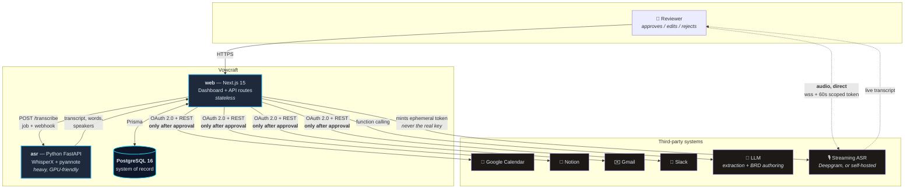
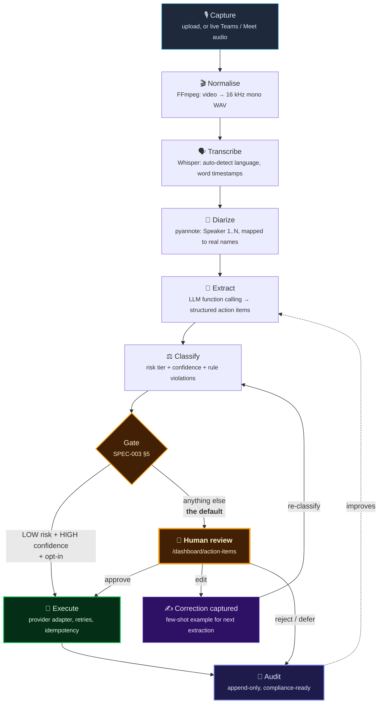
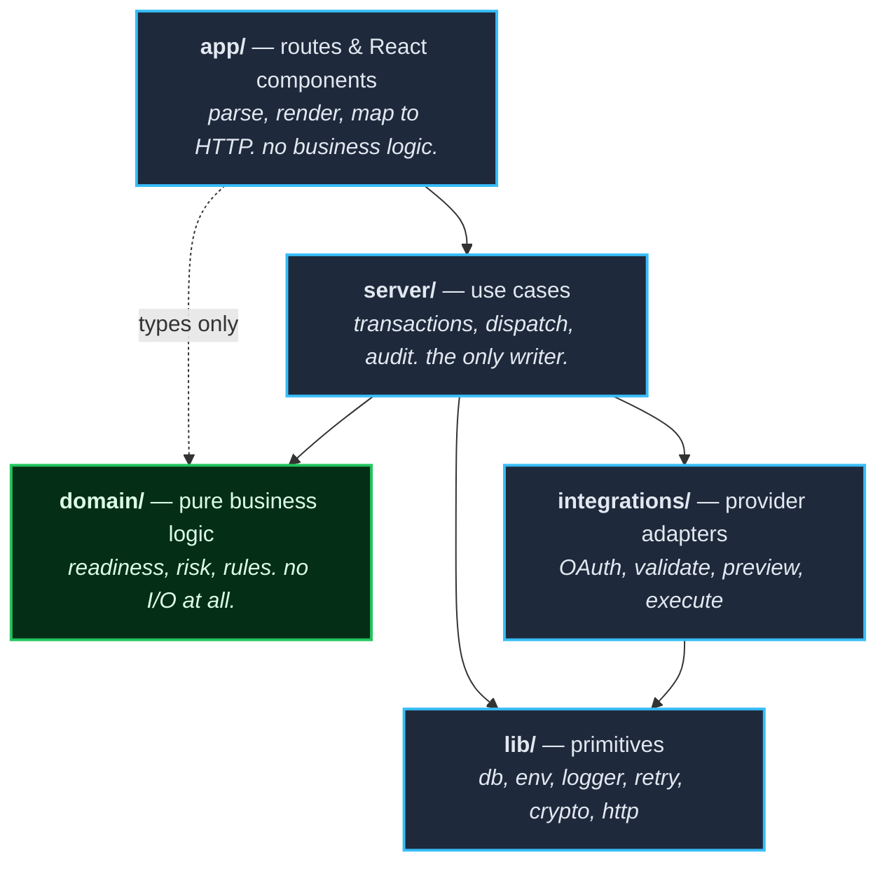
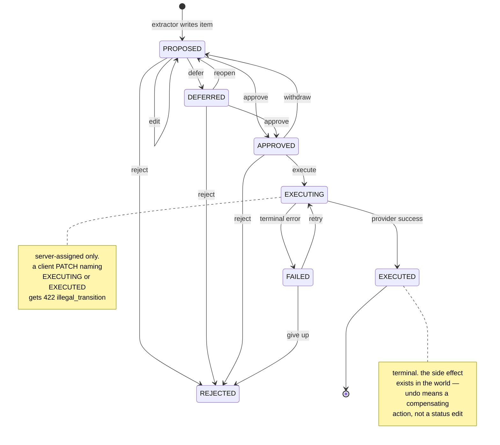
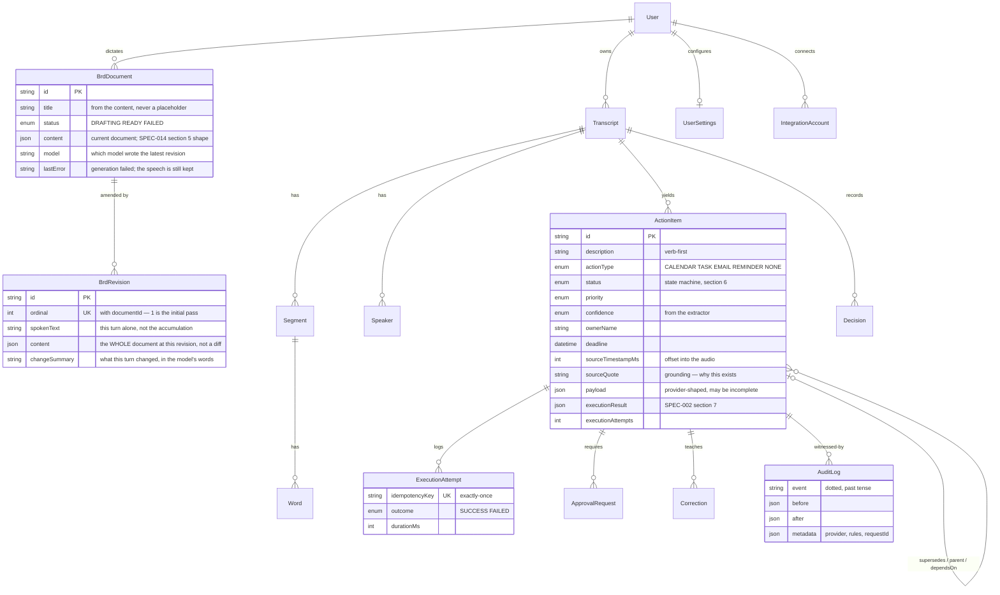
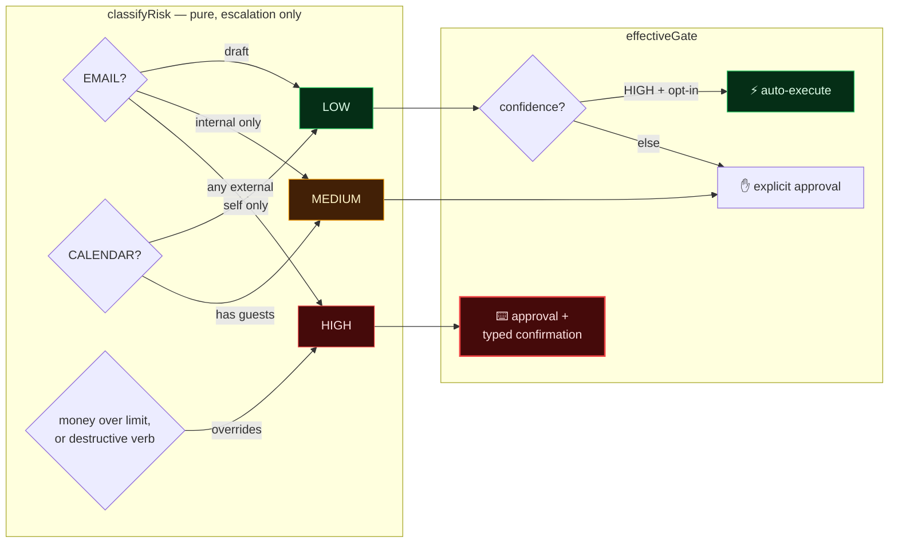
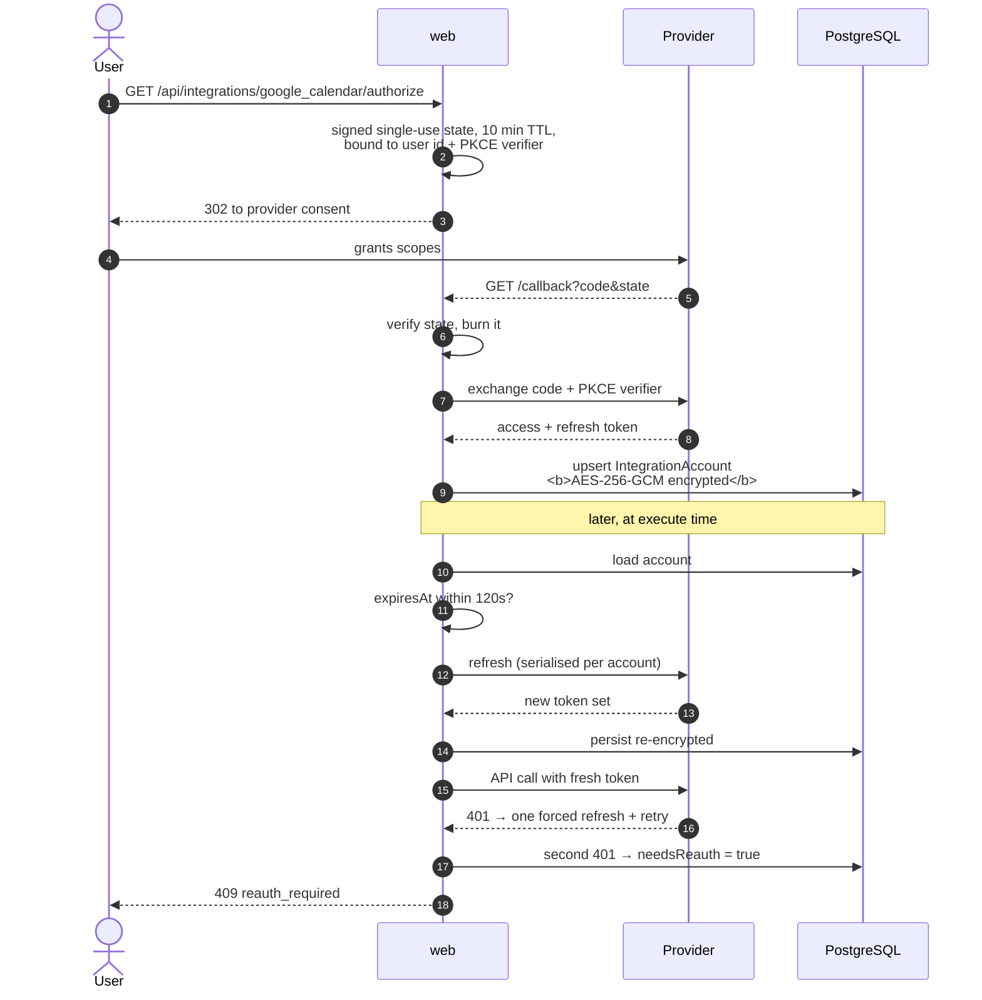
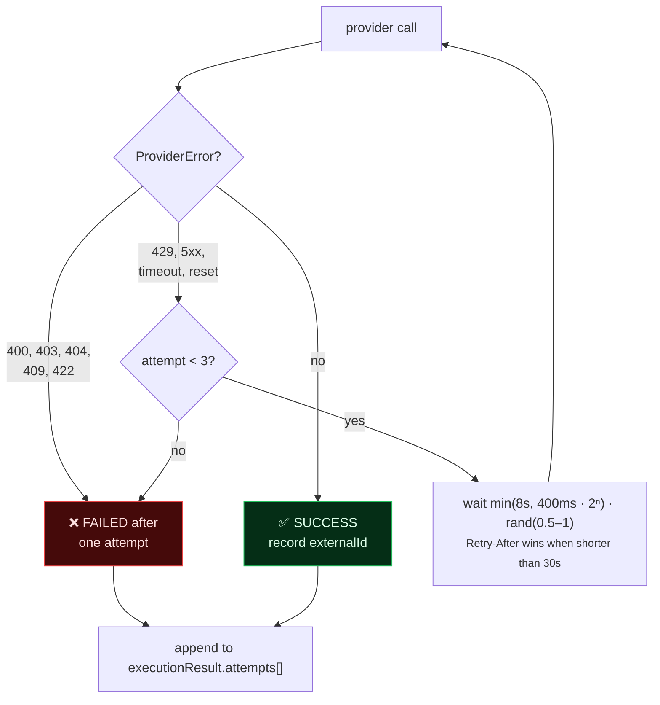
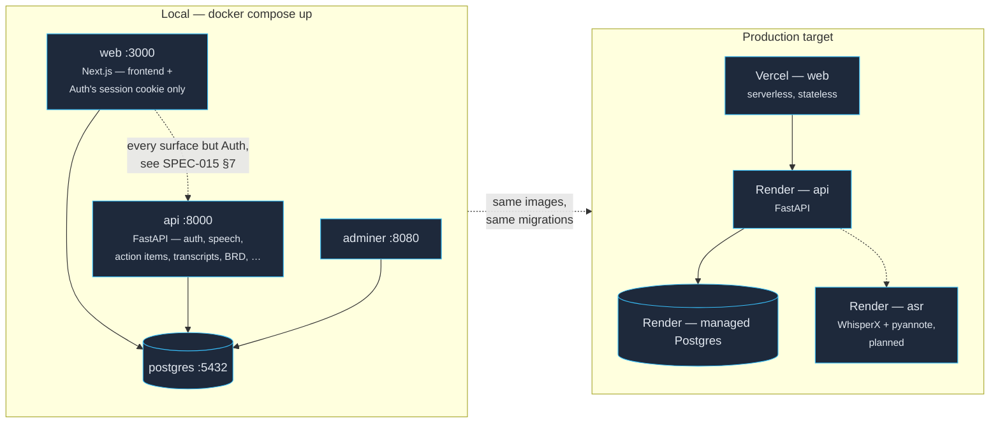

# Vowcraft — Architecture

> Spoken conversation → transcript → extracted intent → **human approval** → real
> side effect in Google Calendar / Notion / Gmail / Slack → immutable audit trail.
>
> This document explains the complete flow. Normative detail lives in
> [`specs/`](./specs); this is the map that ties it together.

---

## 1. The one-paragraph version

There are two ways in, and they meet in the same guardrail machinery.

**Speaking directly to it** (SPEC-014) is the primary one, and the landing
screen: press one button, describe what you need built, and a streaming ASR
provider transcribes you live while a forced tool call turns the result into a
structured **business requirements document**. Speaking again *amends* that
document — requirement ids stay stable, existing wording survives, and the model
reports what it changed — so refinement is an edit rather than a regeneration.

**Uploading a meeting** (SPEC-010) is the other. Audio enters the system and is transcribed with word-level timestamps and
speaker labels by a Python ASR service. An LLM extraction pass turns the
transcript into **action items** — verb-first tasks with an owner, a deadline, a
priority, a confidence score and, critically, *the timestamp and quote they came
from*. Every action item is then classified by **risk**, checked against a
**business-rule engine**, and presented to a human on the Action Items
Dashboard. Nothing reaches a third-party API until a person approves it. On
approval, an executor resolves the item to a provider adapter, merges and
validates the payload, re-runs every guardrail server-side, dispatches with
bounded retries and idempotency, and writes both an `executionResult` and an
append-only audit record.

The load-bearing idea: **the agent proposes, a human disposes, and the system
can prove what happened.** Its corollary, on the voice surface, is that what the
model does *not* know is first-class output: an unspecifiable requirement becomes
an open question rather than a confident invention.

---

## 2. Context — who talks to what

The dotted path is the one exception to "the browser talks only to us", and it is
deliberate — see §2.1.

Two deliberate boundaries:

- **The Node tier never loads an ML model.** All inference is behind an HTTP
  contract, so "run Whisper on the user's laptop, keep the dashboard in the
  cloud" is a deployment choice rather than a rewrite. That is what makes the
  hybrid / offline-privacy mode on the roadmap cheap.
- **Outbound calls to third parties happen in exactly one layer**
  (`apps/api/app/integrations/`), reached through exactly one code path
  (`apps/api/app/services/executor.py` — SPEC-015 §7; the original
  `src/server/execution/executor.ts` was deleted once the frontend's execute
  calls were repointed at FastAPI). There is no second place a stray `fetch`
  could email a customer.

### 2.1 Why live audio bypasses our server

Live transcription is the one place the browser talks to a third party directly,
and the alternatives are worse:

| Option | Why not |
|---|---|
| Relay audio through `web` | Needs a long-lived WebSocket. Next.js route handlers do not provide one and Vercel's serverless runtime does not host one. |
| Ship `DEEPGRAM_API_KEY` to the browser | Hands every user a full-scope project credential that can create and list other keys. |

So the server mints a **60-second, `usage:write`-only** key per session and returns
that. The real key never leaves the server, and the minted one is scoped so
narrowly it cannot even read the project it belongs to (SPEC-014 §3.1).

### 2.2 Streaming ASR is a swappable layer, not a vendor

`server/speech/` is a provider registry with the same shape as `integrations/`:
one interface, one line per implementation, and `SPEECH_PROVIDER` chooses. Two
implementations ship — Deepgram, and a self-hosted WhisperLive — and they differ
in every dimension that matters, which is what keeps the abstraction honest:

| | Deepgram | Self-hosted Whisper |
|---|---|---|
| Socket terminates at | the vendor | your own network |
| Credential | 60s minted token | none |
| Audio | Opus in WebM | 16 kHz PCM |
| Frame shape | `channel.alternatives.0.transcript` / `is_final` | `text` / `completed` |

The browser hard-codes none of that. `POST /api/speech/session` returns a
descriptor carrying the URL, auth mode, audio format **and where the text sits in
each frame**, so the client walks a declared dot-path rather than a vendor's JSON
shape. Swapping providers is one environment variable; adding one is a single
file.

---

## 3. The complete flow, end to end

Phases 1–2 (steps A–E) are specified and schema-ready; **steps F–J are what this
repository implements.** The extraction contract that joins them is frozen in
[SPEC-000 §5](./specs/000-architecture.md).

---

## 4. Layering — dependencies point one way, downward

`domain/` is the part worth guarding. It imports nothing from `lib/db`,
`integrations/`, or `process.env`, which means every guardrail is a pure function
of its inputs and can be unit-tested without a database, a network, or a clock.
`RuleContext` is handed the current time rather than calling `Date.now()` — so
"no meetings on a Sunday" is a test, not a hope.

The inverse of that discipline: `server/` is the **only** layer that writes to
the database or emits audit rows, so there is a single place to look when asking
"how could this row have changed?"

---

## 5. Request flow — the execution path in detail

This is the sequence that matters most, because it is the one with real-world
consequences. Every numbered step maps to
[SPEC-002 §5](./specs/002-execution-integrations.md).

```mermaid
sequenceDiagram
    autonumber
    actor U as Reviewer
    participant UI as ExecuteModal
    participant API as POST /api/action-items/:id/execute
    participant EX as executor
    participant DOM as domain (pure)
    participant TOK as oauth token store
    participant P as provider adapter
    participant DB as PostgreSQL

    U->>UI: clicks Execute
    UI->>API: dryRun: true
    API->>EX: preview
    EX->>DOM: classifyRisk + evaluateRules
    DOM-->>EX: tier MEDIUM, 1 WARN
    EX->>P: preview(payload)
    P-->>EX: "Creates an event for 3 guests"
    API-->>UI: preview + warnings + risk
    UI-->>U: confirmation modal, exact payload shown

    U->>UI: confirms
    UI->>API: execute
    API->>EX: execute(id, override)

    rect rgb(30, 41, 59)
        note over EX,DB: gates — any failure short-circuits and is still audited
        EX->>DB: 1. load item + transcript + settings
        EX->>EX: 2. merge + normalise payload
        EX->>DB: 3. idempotency key seen before?
        DB-->>EX: no prior SUCCESS
        EX->>EX: 4. status must be APPROVED or FAILED
        EX->>EX: 5. dependency EXECUTED?
        EX->>P: 6. validate(payload)
        EX->>DOM: 7. evaluateRules — server-side, again
        DOM-->>EX: no BLOCK
        EX->>DOM: 8. effectiveGate(tier, confidence)
        DOM-->>EX: EXPLICIT_APPROVAL — satisfied
    end

    EX->>DB: 9. status = EXECUTING, open ExecutionAttempt
    EX->>TOK: withFreshToken(account)
    TOK->>TOK: refresh if expiring within 120s
    TOK-->>EX: access token

    loop 10. up to 3 attempts, backoff with full jitter
        EX->>P: execute(payload, ctx)
        P-->>EX: ProviderResult | ProviderError
    end

    rect rgb(5, 46, 22)
        note over EX,DB: 11 + 12 in ONE transaction
        EX->>DB: status = EXECUTED, executionResult, attempt SUCCESS
        EX->>DB: AuditLog "action_item.executed"
    end

    API-->>UI: 200 result
    UI-->>U: "Created — open in Google Calendar ↗"
```

Three properties this shape buys:

| property | mechanism |
|---|---|
| No surprise side effects | the dry-run preview shows the *exact* normalised payload, produced by the same code path that will send it |
| No double-execution | idempotency key = `sha256(itemId + stableStringify(payload))`, checked *before* the status gate so an identical repeat replays rather than duplicating — survives a process restart, not just a debounce |
| No `EXECUTED` row without an audit row | steps 11 and 12 share one transaction |

### 5.1 Why guardrails run twice

The client evaluates rules to *explain* — greying out a button, listing "needs:
startsAt, attendees". The server evaluates them to *enforce*. A request cannot
pass `riskTier`, `violations`, or an approval claim; those fields are ignored if
present. The browser is untrusted, so the only numbers that count are the ones
recomputed from the database row.

---

## 6. Status state machine

`readiness` — `READY` / `NEEDS_CLARIFICATION` / `INFORMATIONAL` — is a *derived*
value computed by a pure function, never stored. It answers a different question
than `status`: not "what did the human decide?" but "could this execute right
now?" Keeping it out of the database means it can never drift from the payload
it describes.

---

## 7. Data model

Three decisions in the BRD pair are worth stating, because the obvious
alternative is wrong in each case:

- **`content` is JSON, not markdown.** Markdown is a rendering. Storing prose
  would force the refinement pass to parse its own previous output back into
  structure, making formatting drift a data-integrity problem (SPEC-014 §4.2).
- **`BrdRevision.content` is the whole document, not a diff.** Any point in
  history is then readable without replay, and one malformed entry cannot break
  the chain. Revisions are an audit trail, not a linked list.
- **`spokenText` is per-turn, not cumulative.** It answers "what did I say that
  caused this change?" — the question asked when a section looks wrong. The
  accumulation is derivable by concatenation; the individual turn is not
  recoverable if only the total is stored (SPEC-014 §4.1).

Notes on the parts that carry weight:

- **`sourceTimestampMs` + `sourceQuote` are not decoration.** They are the
  reviewer's ability to trust the extraction without replaying the meeting, and
  they are what a rule cites when it says an action contradicts a decision.
- **`executionResult` is written on failure too**, including `payloadUsed`. An
  execution nobody can reconstruct afterwards is an execution nobody can debug.
- **`AuditLog` is append-only in code and in permissions** — production grants
  the app's DB role `INSERT`/`SELECT` only on that table.
- **`Correction`** captures every human edit with its transcript excerpt. Cheap
  now, and it turns "learn from corrections" into a prompt change later rather
  than a schema migration.

---

## 8. Risk classification and the approval gate

Rules may **raise** a tier and never lower one, and `autoExecuteLowRisk`
defaults to `false`. Two conventions in the same spirit:

- `INTEGRATIONS_MODE=mock` is the **default**, so a fresh checkout is never one
  click away from emailing a stranger. Mock results carry `simulated: true` and
  the UI labels them.
- Approval requests expire after 48h into `DEFERRED`, never into approved.
  **Fail closed** — a timeout is not consent.
- Gmail send is treated as non-idempotent: a timeout *after* dispatch records
  `FAILED` with `uncertain: true` rather than resending. A missing email is
  recoverable; a duplicate to a customer is not.

---

## 9. OAuth and token handling

Tokens are encrypted at rest as `v1.<iv>.<tag>.<ct>` under
`APP_ENCRYPTION_KEY`, and are never logged, never returned by any API, and never
serialised into `executionResult`.

---

## 10. Retry policy

Retry only what can succeed later. A malformed calendar event is malformed on
the third try too — retrying it just delays the error the user needs to see.
Full jitter, not plain exponential backoff, so a provider outage doesn't produce
a synchronised thundering herd when many items are executed at once.

---

## 11. Deployment

The backend has completed its migration from Next.js route handlers to a standalone FastAPI
service — SPEC-015 has the full account. Every application surface — speech, action items
(execution included), transcripts/ingest (upload, demux, transcription, extraction),
settings, profile, the audit log, credentials (the BYOK vault), and BRD — is fully cut
over: the frontend calls FastAPI directly, and each surface's Next.js implementation was
deleted once its repoint was verified. Auth (signup/login/refresh/logout/password) is the
one deliberate exception, and stays dual-running indefinitely, not as unfinished work: a
server-rendered dashboard page still needs the Next.js session cookie to identify its user
during SSR, so `src/lib/api-token.ts` mints a short-lived FastAPI-compatible token from that
cookie rather than every page becoming a client component — see SPEC-015 §4.1. All eight
completed repoints are worth reading before touching either backend again: most of the work
in each was closing real contract gaps between the two implementations that a pytest pass
alone did not surface, only pointing the acceptance suite (`scripts/smoke.sh`) at FastAPI
and iterating to a clean run did — see SPEC-015 §7 for the specific lists. Action items
turned up a domain-logic readiness bug and an integrations-mode default that inverted a
safety property; transcripts/ingest turned up a structural one — the pipeline could not
complete at all without a real provider API key, meaning `docker compose up` could not
demonstrate the product — plus the cross-origin consequence that a browser cannot attach a
bearer token to a plain `<audio src>` or download `<a href>`, which the frontend repoint had
to work around with an authenticated blob fetch; settings turned up a bug *class* — a
business-rule check encoded as a Pydantic field constraint answers the generic `400
invalid_request` instead of its documented `422` code, silently, because both a type
mismatch and a rejected business rule raise inside FastAPI in a way that looks identical
from the route's own code; profile turned up the most severe finding of any surface but
one — account deletion had no confirmation check at all, accepting any authenticated
`DELETE` regardless of body, plus a dead end where an account with no password could never
set one because the handler's own error message pointed back at the action that produced
it; the audit log turned up a pagination-style mismatch (`offset` vs. the frontend's
cursor-based "load more") plus two fields the viewer renders directly — `actorLabel`,
`actionItemDescription` — that the port had simply left out; credentials turned up the
largest gap of the whole migration — a 31-service catalogue ported as 9, `verify` and
`/status` entirely unimplemented, and a raw service id (`"groq"`) returned where the UI
renders a display name (`"Groq — Whisper large-v3 turbo"`) directly; BRD, the last surface,
turned up the most conceptually pointed finding of all — bounds ported from the original's
zod schema as silent truncation instead of outright rejection, directly at odds with BRD's
own stated design philosophy of "never invent, surface what you can't represent as an
`openQuestion`" rather than reshape it to fit. Deleting BRD's own Next.js code also
triggered a second-order cleanup: `src/server/extraction/providers.ts` and `schema.ts`,
kept alive since the transcripts/ingest cutover specifically because BRD generation still
imported them, had zero remaining callers once BRD's `generate.ts` was gone, so the whole
`src/server/extraction/` directory came out too — which in turn surfaced a real, previously
undetected gap: `extraction/schema.ts`'s validation had a Vitest suite with no Python
equivalent anywhere, ported as `apps/api/tests/test_extraction_contract.py` before the
Vitest file was deleted. All of the above are worth knowing regardless of the migration's
own status, since none of them were migration artifacts so much as bugs the migration was
the first thing to actually exercise.

`docker compose up` brings up all three local services — `db`, `api`, `web` — with seeded
data, no third-party credentials, and every action type executable in mock mode. `api` runs
`alembic upgrade head` on boot, the same way `web` runs `prisma db push`; both are idempotent,
so restarting the stack never fails on an already-current schema. The same images and the
same migrations are meant to run in production, Render's managed Postgres standing in for the
local `db` container — that handoff is not yet exercised end-to-end, only the local
three-service topology is.

---

## 12. Where to look in the code

| Question | File |
|---|---|
| What does the dashboard render? | [`src/app/dashboard/action-items/page.tsx`](./src/app/dashboard/action-items/page.tsx) — first paint via `apiServerJson`; list/patch/bulk/execute all call FastAPI directly, see the table below |
| What renders the recordings library / reader? | [`src/app/dashboard/transcripts/page.tsx`](./src/app/dashboard/transcripts/page.tsx) + [`[id]/page.tsx`](./src/app/dashboard/transcripts/[id]/page.tsx) — first paint via `apiServerJson`; upload/poll/export/speaker-rename/audio playback all call FastAPI directly (the latter two via an authenticated blob fetch, not a plain `src`/`href`, since the backend is cross-origin) |
| What renders the preferences (guardrail envelope) form? | [`src/app/dashboard/settings/page.tsx`](./src/app/dashboard/settings/page.tsx) — first paint via `apiServerJson`; [`PreferencesForm.tsx`](./src/components/settings/PreferencesForm.tsx) saves via `apiFetch` |
| What renders account/profile management? | [`src/app/dashboard/settings/profile/page.tsx`](./src/app/dashboard/settings/profile/page.tsx) — first paint via `apiServerJson`; [`ProfileManager.tsx`](./src/components/profile/ProfileManager.tsx) saves via `apiFetch` — password change specifically posts to `/api/auth/change-password` (the Auth surface, not Profile) and must `storeTokens(...)` the fresh pair it returns before anything else, since rotating the hash revokes the token the request authenticated with |
| What renders the audit log? | [`src/app/dashboard/audit-log/page.tsx`](./src/app/dashboard/audit-log/page.tsx) — first paint via `apiServerJson`; [`AuditLogViewer.tsx`](./src/components/audit/AuditLogViewer.tsx) fetches via `apiFetch`, paginating on the response's `nextCursor` |
| What renders the BYOK credentials page? | [`src/app/dashboard/settings/credentials/page.tsx`](./src/app/dashboard/settings/credentials/page.tsx) — first paint via `apiServerJson`; [`CredentialsManager.tsx`](./src/components/credentials/CredentialsManager.tsx) calls FastAPI via `apiFetch` for list/save/verify/delete, but still imports `MODULE_META`/`TIER_META` and the `CredentialView`/`ModuleAvailability` types directly from [`src/lib/credentials/`](./src/lib/credentials/) — those are pure presentation data with no DB access, so they never needed to move |
| What renders the BRD documents list / detail page? | [`src/app/dashboard/brd/page.tsx`](./src/app/dashboard/brd/page.tsx) + [`[id]/page.tsx`](./src/app/dashboard/brd/[id]/page.tsx) — first paint via `apiServerJson`; [`VoiceRecorder.tsx`](./src/components/brd/VoiceRecorder.tsx)/[`RefineRecorder.tsx`](./src/components/brd/RefineRecorder.tsx) create/refine via `apiFetch`; export goes through [`BrdExportLink.tsx`](./src/components/brd/BrdExportLink.tsx), an authenticated blob fetch, not a plain `href`, the same cross-origin pattern as transcripts' audio/export |
| How is readiness / grouping decided (reference; the live path is FastAPI's mirror) | [`src/domain/action-item.ts`](./src/domain/action-item.ts) |
| How is risk classified (reference) | [`src/domain/risk.ts`](./src/domain/risk.ts) |
| Where do the business rules live (reference) | [`src/domain/rules/`](./src/domain/rules/) |
| How do I add a provider (reference; the live path is `apps/api/app/integrations/`) | [`src/integrations/registry.ts`](./src/integrations/registry.ts) + `src/integrations/types.ts` |
| Where is the audit trail written? | [`src/lib/audit.ts`](./src/lib/audit.ts) |
| What is the DB shape? | [`prisma/schema.prisma`](./prisma/schema.prisma) |
| How does authentication work? | [`src/lib/session.ts`](./src/lib/session.ts) + [`src/lib/auth.ts`](./src/lib/auth.ts) |
| Where do the nav modules come from? | [`src/lib/navigation.ts`](./src/lib/navigation.ts) |
| How does the voice surface work? | [`src/components/brd/VoiceRecorder.tsx`](./src/components/brd/VoiceRecorder.tsx) + [`useLiveTranscription.ts`](./src/components/brd/useLiveTranscription.ts) — talks to FastAPI directly, not Next.js |
| Why do two nav entries share a URL prefix? | [`src/components/ui/Sidebar.tsx`](./src/components/ui/Sidebar.tsx) `isActive()` — see §12.1 |
| What drives the landing dashboard? | [`src/server/analytics/service.ts`](./src/server/analytics/service.ts) |
| Where is the palette defined? | [`src/app/globals.css`](./src/app/globals.css) |

**FastAPI (`apps/api/`) — SPEC-015.** The frontend pointers above are almost all Next.js
*pages* calling FastAPI directly, not Next.js API routes — the only Next.js API route left
is Auth's, kept deliberately (§11). A few rows above are marked "reference" — real, live TS
files, just no longer the path an actual request takes, superseded by their FastAPI
equivalent below:

| Question | File |
|---|---|
| Where do routes live? | [`apps/api/app/api/routes/`](./apps/api/app/api/routes/) — one module per surface |
| How is a request authenticated? | [`apps/api/app/api/dependencies.py`](./apps/api/app/api/dependencies.py) — JWT, not a cookie; see SPEC-015 §4.1 |
| Where do the 17 guardrail rules live? | [`apps/api/app/domain/rules/`](./apps/api/app/domain/rules/) |
| How is risk classified? | [`apps/api/app/domain/risk.py`](./apps/api/app/domain/risk.py) |
| What actually executes an action? | [`apps/api/app/services/executor.py`](./apps/api/app/services/executor.py) |
| How do I add a provider? | [`apps/api/app/integrations/registry.py`](./apps/api/app/integrations/registry.py) + `adapters.py` |
| Where is a BRD written or amended? | [`apps/api/app/services/brd.py`](./apps/api/app/services/brd.py), contract in [`domain/brd.py`](./apps/api/app/domain/brd.py) |
| Where does upload/transcribe/extract happen? | [`apps/api/app/services/ingest/`](./apps/api/app/services/ingest/) (validate, demux, pipeline orchestration) + [`transcription.py`](./apps/api/app/services/transcription.py) + [`extraction.py`](./apps/api/app/services/extraction.py)/[`llm.py`](./apps/api/app/services/llm.py) — both have a bundled-sample fallback so the pipeline completes with zero API keys configured |
| Where is a transcript read, exported, or renamed? | [`apps/api/app/services/transcripts.py`](./apps/api/app/services/transcripts.py) + [`transcript_export.py`](./apps/api/app/services/transcript_export.py) |
| Where does the guardrail envelope (settings) live? | [`apps/api/app/services/settings_profile.py`](./apps/api/app/services/settings_profile.py)'s `SettingsService` — every business rule (workday ordering, time zone existence, org-domain format, provider-routing existence) is an explicit check there, deliberately not a Pydantic field constraint; see SPEC-015 §7 for why |
| Where does profile (rename/onboarding/deletion) live? | Same file, `ProfileService` — deletion's email-confirmation check and the onboarding `restart` action were both added during its cutover, see SPEC-015 §7 |
| Where does password change live? | [`apps/api/app/services/auth.py`](./apps/api/app/services/auth.py)'s `AuthService.change_password` — on the Auth surface, not Profile, because rotating the hash issues a fresh token pair the same way login does |
| Where does the audit log query live? | [`apps/api/app/services/audit.py`](./apps/api/app/services/audit.py)'s `AuditService` — keyset (seek) pagination on `(at, id)`, not `OFFSET`, to match the frontend's cursor-based "load more" and stay stable under concurrent inserts |
| Where does the BYOK credential vault live? | [`apps/api/app/services/credentials.py`](./apps/api/app/services/credentials.py) — the full 31-service catalogue (`CATALOG`), resolution order, and `verify`'s per-service recipe mechanism (bearer/header/query auth); `src/lib/credentials/catalog.ts` is still the source of truth for the *frontend's* presentation layer, so a new provider needs an entry in both |
| Where is the streaming-ASR relay? | [`apps/api/app/api/routes/speech.py`](./apps/api/app/api/routes/speech.py) — the WebSocket the browser actually connects to |
| Where are the DB models? | [`packages/db/vowcraft_db/models/`](./packages/db/vowcraft_db/models/) — mirrors the live Prisma schema exactly, see SPEC-015 §3 |
| How does a Server Component call FastAPI? | [`src/lib/api-server.ts`](./src/lib/api-server.ts) + [`src/lib/api-token.ts`](./src/lib/api-token.ts) — mints its own bearer token server-side; SPEC-015 §4.1 |
| How does the browser call FastAPI? | [`src/lib/api-client.ts`](./src/lib/api-client.ts) — the `sessionStorage` token pair, not a cookie |
| Which surfaces are cut over vs. still dual-running? | SPEC-015 §7 |

### 12.1 Nav routes: Recordings vs Transcript reader

Two nav modules sit under the same URL prefix, which needs one deliberate rule rather than
an accident:

| Nav module | Route it owns | Spec |
|---|---|---|
| Recordings | exactly `/dashboard/transcripts` — the library, nothing beneath it | SPEC-010 |
| Transcript reader | everything under `/dashboard/transcripts/` — `/reader` and any `:id` | SPEC-012 §2.1 |

`isActive()` in `Sidebar.tsx` encodes exactly that split. The default rule elsewhere in the
nav is "this route or any descendant", which is right for every other module but would mark
both of these current on every transcripts URL — they were originally the same `href`, so
both highlighted together. The reader also gains `/dashboard/transcripts/reader`, which
redirects to the newest readable transcript, because a module in the nav needs somewhere to
go and "read a transcript" has no meaning without a transcript.

### Adding a new ASR provider

1. Implement `SpeechProvider` in `src/server/speech/<name>.ts` — two methods:
   `availability()` (so the UI can state why it is unavailable without minting
   anything) and `session()` (which returns a descriptor, never a long-lived key).
2. Register it in `src/server/speech/registry.ts`.
3. Add its env vars to `.env.example`.

No changes to `app/`, to the browser client, or to the BRD layer. The client reads
URL, auth mode, audio format and frame shape from the descriptor (§2.2), so a
provider whose transport differs completely — self-hosted, no credential, PCM
audio, different JSON — needs no client work at all.

### Adding a new integration

1. Implement `IntegrationProvider` in `src/integrations/<name>.ts` — five
   methods, no framework coupling.
2. Register it in `src/integrations/registry.ts`.
3. Add its scopes to `.env.example`.

No changes to `app/`, `server/`, or `domain/`. Adding a *rule* is the same
shape: one file in `domain/rules/`, one registry line. Those two extension
points are the ones a reviewer will probe, so they are deliberately the two
cheapest changes in the codebase.
